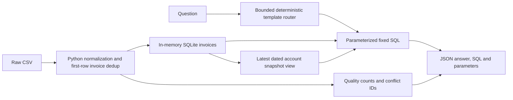

# Actual architecture

```mermaid
flowchart LR
    CSV[Raw CSV] --> Clean[Python normalization and first-row invoice dedup]
    Clean --> Quality[Quality counts and conflict IDs]
    Clean --> DB[In-memory SQLite invoices]
    DB --> Snap[Latest dated account snapshot view]
    Q[Question] --> Router[Bounded deterministic template router]
    Router --> SQL[Parameterized fixed SQL]
    DB --> SQL
    Snap --> SQL
    SQL --> Answer[JSON answer, SQL and parameters]
    Quality --> Answer
```

SQLite is made query-only after loading. No model or remote service participates in the demo.
